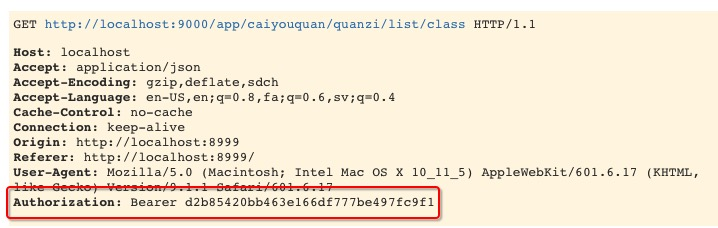
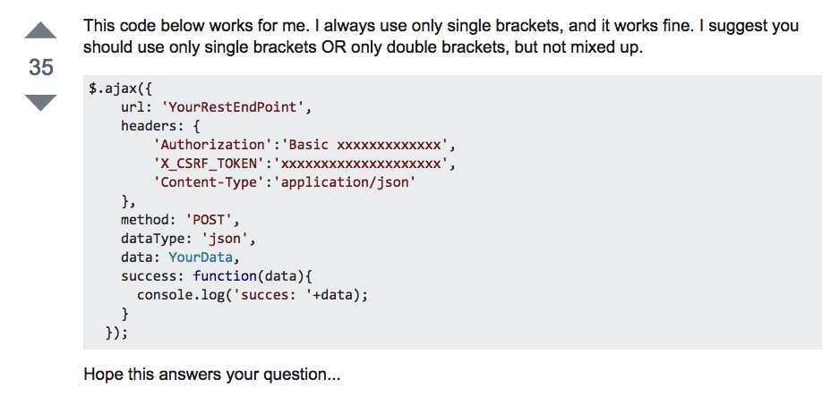

# 财神谷项目 web端

## 关于用户登陆验证的本地存储

- OAuth2.0 在Header中存储形式

    
- web端的实现形式
    - [LocalStorage](http://harttle.com/2015/08/16/localstorage-sessionstorage-cookie.html)
    - [Add Header in AJAX Request with jQuery]

        
